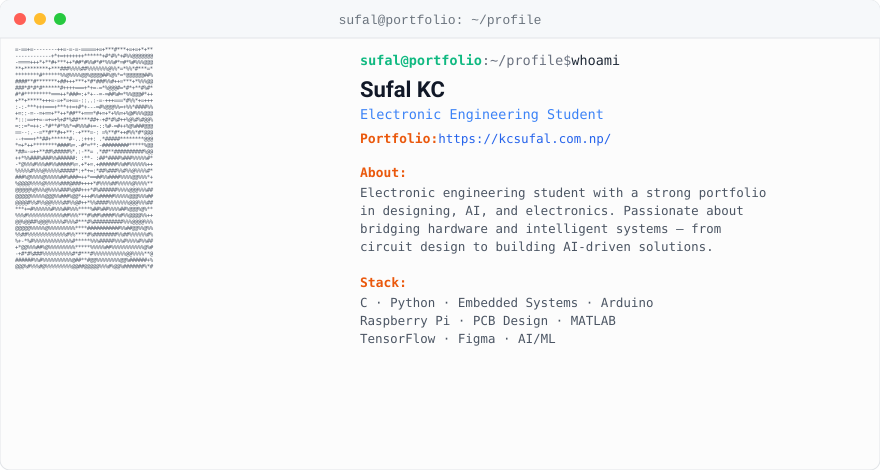

  

  
  

  <picture>
    <source media="(prefers-color-scheme: dark)" srcset="./metrics/dark_mode.svg" />
    <source media="(prefers-color-scheme: light)" srcset="./metrics/light_mode.svg" />
    
  </picture>

  <h3>Connect</h3>
  
  

